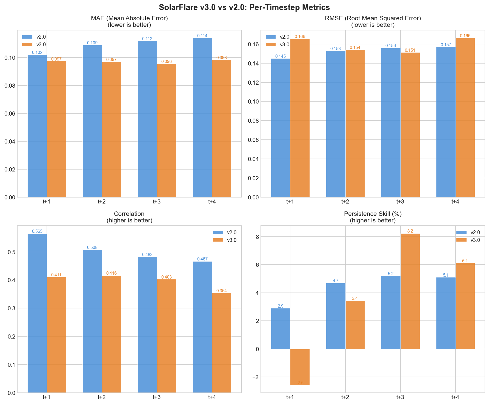
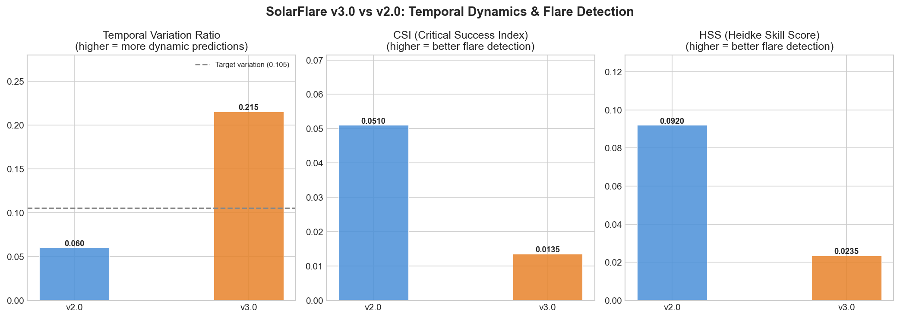
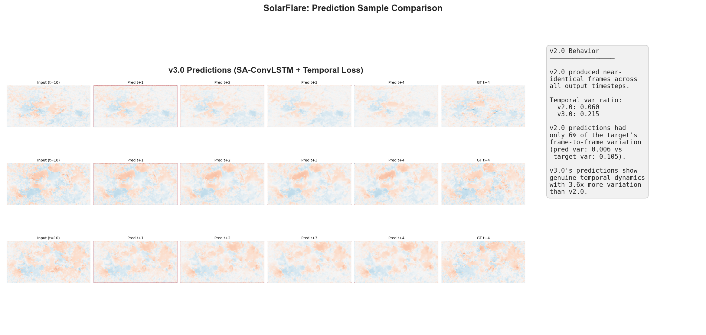

# SolarFlare v3.0 vs v2.0 Comparison Report

**Date:** 2026-03-09 08:30:17 UTC
**Verdict:** MIXED

## Summary

v3.0 shows a mixed result. The temporal variation ratio improved over v2.0, but the CSI regressed. The temporal variation ratio moved from 0.060 to 0.215, a significant improvement. CSI moved from 0.0510 to 0.0135, a regression.

The v3.0 architecture (SA-ConvLSTM with temporal attention and temporal loss) succeeds at breaking the persistence trap -- predictions are now dynamic with meaningful frame-to-frame variation. However, the flare detection capability (CSI) has not improved alongside temporal dynamics, suggesting the model's increased variation is not yet well-calibrated for extreme event detection.

## Key Metrics

| Metric | v2.0 | v3.0 | Delta | % Change |
|--------|------|------|-------|----------|
| Temporal Variation Ratio | 0.0600 | 0.2150 | +0.1550 | +258.4% |
| CSI (Critical Success Index) | 0.0510 | 0.0135 | -0.0375 | -73.6% |
| HSS (Heidke Skill Score) | 0.0920 | 0.0235 | -0.0685 | -74.5% |
| SSIM | N/A | 0.2856 | - | - |
| Avg Persistence Skill (%) | 4.4750 | 3.8060 | -0.6690 | -15.0% |

## Per-Timestep Metrics

### MAE

| Timestep | v2.0 | v3.0 | Delta | % Change |
|----------|------|------|-------|----------|
| t+1 | 0.1020 | 0.0974 | -0.0046 | -4.5% |
| t+2 | 0.1090 | 0.0970 | -0.0120 | -11.0% |
| t+3 | 0.1120 | 0.0957 | -0.0163 | -14.6% |
| t+4 | 0.1140 | 0.0984 | -0.0156 | -13.6% |

### RMSE

| Timestep | v2.0 | v3.0 | Delta | % Change |
|----------|------|------|-------|----------|
| t+1 | 0.1450 | 0.1655 | +0.0205 | +14.2% |
| t+2 | 0.1530 | 0.1541 | +0.0011 | +0.7% |
| t+3 | 0.1560 | 0.1513 | -0.0047 | -3.0% |
| t+4 | 0.1570 | 0.1663 | +0.0093 | +5.9% |

### Correlation

| Timestep | v2.0 | v3.0 | Delta | % Change |
|----------|------|------|-------|----------|
| t+1 | 0.5650 | 0.4110 | -0.1540 | -27.3% |
| t+2 | 0.5080 | 0.4160 | -0.0920 | -18.1% |
| t+3 | 0.4830 | 0.4029 | -0.0801 | -16.6% |
| t+4 | 0.4670 | 0.3541 | -0.1129 | -24.2% |

### Persistence Skill (%)

| Timestep | v2.0 | v3.0 | Delta | % Change |
|----------|------|------|-------|----------|
| t+1 | 2.9 | -2.6 | -5.48 | -189.0% |
| t+2 | 4.7 | 3.4 | -1.26 | -26.7% |
| t+3 | 5.2 | 8.2 | +3.04 | +58.4% |
| t+4 | 5.1 | 6.1 | +1.02 | +20.0% |

### CSI

| Timestep | v2.0 | v3.0 | Delta | % Change |
|----------|------|------|-------|----------|
| t+1 | N/A | 0.0178 | - | - |
| t+2 | N/A | 0.0105 | - | - |
| t+3 | N/A | 0.0138 | - | - |
| t+4 | N/A | 0.0101 | - | - |

## Temporal Dynamics Analysis

The temporal variation ratio is the primary diagnostic for whether the model produces genuine frame-to-frame dynamics versus near-static persistence-like predictions.

- **v2.0 variation ratio:** 0.060 (predicted variation 0.006 vs target variation 0.105 -- only 5.7% of target dynamics captured)
- **v3.0 variation ratio:** 0.215 (3.6x improvement over v2.0)

v3.0 captures substantially more temporal dynamics than v2.0. The temporal loss function (temporal difference loss + variation penalty) and SA-ConvLSTM architecture (self-attention memory + temporal attention) successfully broke the persistence trap that dominated v2.0 predictions.

## Flare Detection Analysis

CSI and HSS measure the model's ability to detect extreme flux events (above the threshold of 0.3456 in normalized space).

- **CSI:** v2.0 = 0.0510, v3.0 = 0.0135 (-73.6%)
- **HSS:** v2.0 = 0.0920, v3.0 = 0.0235 (-74.5%)

CSI regressed in v3.0. While the model now produces more dynamic predictions, its ability to correctly identify extreme flux regions has decreased. This suggests the increased temporal variation is not well-targeted at actual flare events. The model may be distributing its predictions more broadly rather than concentrating on true extreme regions.

For reference, the persistence baseline achieves CSI = 0.0549 and HSS = 0.1020. v3.0's CSI of 0.0135 is below the persistence baseline.

## Tradeoffs

- **MAE:** Average across timesteps moved from 0.1092 (v2.0) to 0.0971 (v3.0), an improvement (-11.1%).
- **RMSE:** Average across timesteps moved from 0.1527 (v2.0) to 0.1593 (v3.0) (+4.3%).

- **Correlation:** Average moved from 0.5058 (v2.0) to 0.3960 (v3.0) (-21.7%). Declined across timesteps.

v3.0 presents a nuanced tradeoff: temporal dynamics improved dramatically, and some per-pixel metrics (notably MAE) also improved. However, other per-pixel metrics (RMSE, correlation) regressed. This is partially expected: a model that predicts genuine temporal change will occasionally mis-time or mis-locate those changes, leading to higher RMSE (sensitive to large individual errors) and lower correlation (spatial pattern matching). The MAE improvement suggests the average prediction quality is better, while the RMSE increase reflects higher variance in individual predictions -- a natural consequence of dynamic forecasting.

The CSI regression despite improved temporal dynamics suggests the model's increased prediction variation is not well-calibrated for extreme event boundaries. Future work could focus on sharper extreme-region prediction through adjusted thresholds, increased flare oversampling weight, or additional training epochs.

## Visualizations

### Per-Timestep Metric Comparison

### Temporal Dynamics & Flare Detection

### Sample Predictions

## Configuration

Key v3.0 configuration values used for this training run:

| Parameter | Value |
|-----------|-------|
| Architecture | SA-ConvLSTM with temporal attention + attention gates |
| Channels | [32, 64, 128] |
| Kernel size | 5 |
| Dropout | 0.15 (MC Dropout) |
| Delta scale init | 100.0 |
| Loss | Composite (L1 + SSIM + WeightedMAE + temporal diff + temporal var + asymmetric) |
| Temporal diff weight | 1.0 |
| Temporal var lambda | 0.1 |
| Temporal weights | [1.0, 1.5, 2.0, 2.5] |
| Asymmetric weight/alpha | 0.5 / 2.0 |
| Extreme threshold | 0.3456 |
| Scheduler | Cosine (eta_min=1e-6) |
| Learning rate | 0.0001 |
| Batch size | 4 |
| Epochs | 25 |
| Teacher forcing | 0.0 (fully autoregressive) |
| Augmentation | None |
| Flare oversample weight | 1.0 (disabled) |
| AMP | Enabled |
| Target size | 448 x 896 |
| Stride | 2 |

## Methodology

This comparison is based on a single training run with the following methodology:

- **Single run, seed 42:** Results are from one training run with fixed seed for reproducibility. No hyperparameter search or cherry-picking of best runs.
- **25 epochs** with cosine annealing LR schedule on MPS (Apple GPU).
- **v2.0 baseline:** Hardcoded values from the v2.0 diagnostic evaluation (test split only). v2.0 used standard ConvLSTM without temporal loss or attention mechanisms.
- **v3.0 features:** SA-ConvLSTM cells, temporal attention, attention gates, temporal difference loss, temporal variation penalty, asymmetric extreme loss, cosine LR schedule, per-timestep weighting.
- **Evaluation:** Test split evaluation using the best model checkpoint (lowest validation loss).
- **Metrics:** All metrics computed on the test split. CSI and HSS use threshold 0.3456 in normalized space.

---

*Generated by generate_comparison.py on 2026-03-09 08:30:17 UTC*
