# SolarFlare Architecture Diagrams

---

## 1. High-Level System Overview

> **What** SolarFlare does, **why** it exists, and **how** it works at the highest level.

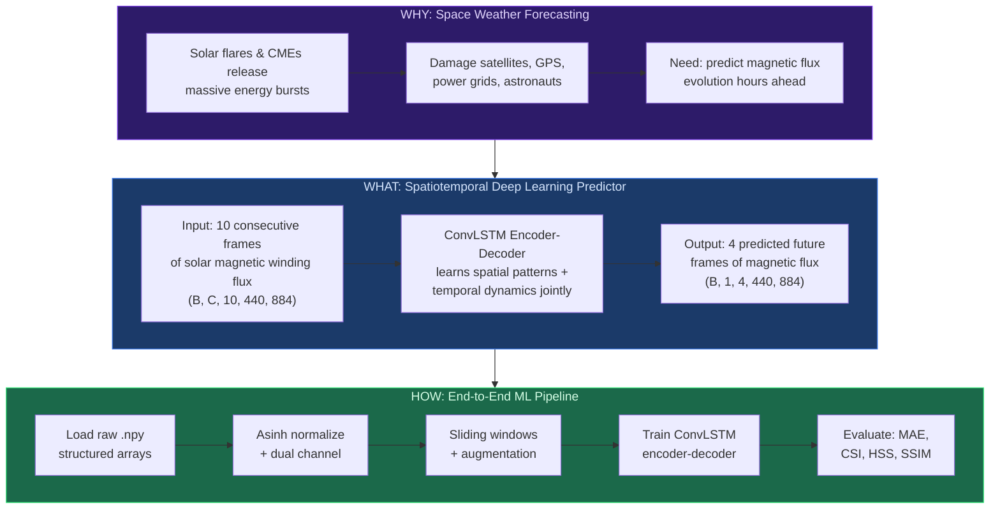

---

## 2. Data Pipeline

> From raw solar observations to GPU-ready training batches.

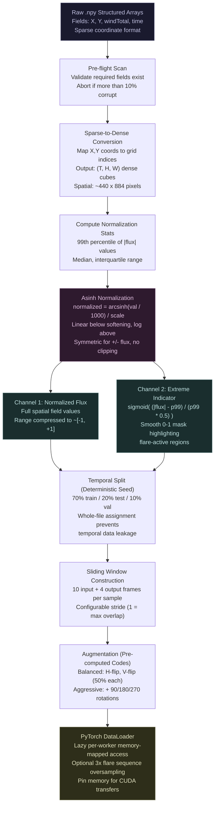

### Data Pipeline Equations

**Asinh Normalization** (preserves extreme values, handles negatives symmetrically):

$$\hat{v} = \frac{\text{arcsinh}(v / s)}{S_{max}}, \quad \text{arcsinh}(x) = \ln(x + \sqrt{x^2 + 1})$$

Where $v$ is the raw flux value, $s = 1000.0$ is the softening parameter (typical non-flare magnitude), and $S_{max}$ is computed so that $\hat{v} \in [-1, 1]$.

**Behavior:** For $|v| \ll s$: $\hat{v} \approx v/s$ (linear). For $|v| \gg s$: $\hat{v} \approx \text{sgn}(v) \cdot \ln(2|v|/s)$ (logarithmic compression).

**Extreme Indicator Channel:**

$$\text{Ch}_2(v) = \sigma\left(\frac{|v| - \tau}{\tau / 2}\right) = \frac{1}{1 + \exp\left(-\frac{|v| - \tau}{\tau / 2}\right)}$$

Where $\tau = P_{99}(|v|)$ is the 99th percentile of absolute flux values. Produces a smooth 0-1 mask: background $\approx 0$, flare regions $\approx 1$.

**Residual Prediction:**

$$\hat{y}_t = x_{last} + \Delta_t, \quad \Delta_t = \gamma \cdot f_\theta(h_t^{dec})$$

Where $x_{last}$ is the last input flux frame, $f_\theta$ is the output Conv2d head, and $\gamma$ is the optional learnable delta scale (initialized near 1.0).

---

## 3. Model Architecture Overview

> The full encoder-decoder pipeline from input to predicted frames.

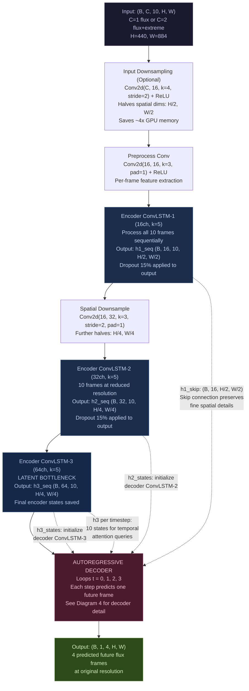

---

## 4. Decoder Detail (One Autoregressive Step)

> What happens inside the decoder at each of the 4 prediction steps.

```mermaid
flowchart TD
    FRAME_IN["Current Input Frame<br/>(B, C, H, W)<br/>t=0: last observed frame<br/>t>0: previous prediction"]

    FRAME_IN --> DEC_DOWN["Downsample to Latent<br/>input_down (stride=2) then<br/>decoder_proj Conv2d(16, 32, stride=2)<br/>Result: (B, 32, H/4, W/4)"]

    DEC_DOWN --> DCONV2["Decoder ConvLSTM-2 (32ch)<br/>Continues encoder h2 hidden state<br/>Single timestep processing"]

    DCONV2 --> DROP["MC Dropout (15%)<br/>Kept active at inference for<br/>uncertainty quantification"]

    DROP --> DCONV3["Decoder ConvLSTM-3 (64ch)<br/>Continues encoder h3 hidden state<br/>Output: decoder h3 (B, 64, H/4, W/4)"]

    DCONV3 --> TA_CHECK{"Temporal<br/>Attention<br/>enabled?"}

    TA_CHECK -->|Yes| TEMP_ATTN["Temporal Attention Module<br/>See Diagram 5 for mechanism<br/>Adds context from encoder history"]
    TA_CHECK -->|No| PASSTHRU["Pass through unchanged"]

    TEMP_ATTN --> UP
    PASSTHRU --> UP

    UP["Upsample<br/>ConvTranspose2d(64, 32, k=4, stride=2)<br/>Result: (B, 32, H/2, W/2)"]

    UP --> AG_CHECK{"Attention<br/>Gate<br/>enabled?"}

    AG_CHECK -->|Yes| ATTN_GATE["Attention Gate (ARCH-03)<br/>See Diagram 7 for mechanism<br/>Spatially gates the skip features"]
    AG_CHECK -->|No| RAW_SKIP["Raw concatenation"]

    ATTN_GATE --> CONCAT["Concatenate: gated_skip + upsampled<br/>(B, 16+32, H/2, W/2)"]
    RAW_SKIP --> CONCAT

    CONCAT --> REFINE["Refine ConvLSTM (48ch in, 16ch out)<br/>Polishes combined encoder+decoder<br/>features into coherent prediction"]

    REFINE --> OUTCONV["Output Head<br/>ConvTranspose2d(16, 16, stride=2) + ReLU<br/>Conv2d(16, 1, k=1)<br/>Produces residual delta"]

    OUTCONV --> SCALE{"Learnable<br/>delta scale?"}
    SCALE -->|Yes| SCALED["delta = raw_delta * learned_param<br/>Initialized near 1.0"]
    SCALE -->|No| UNSCALED["delta = raw_delta"]

    SCALED --> RESIDUAL
    UNSCALED --> RESIDUAL

    RESIDUAL["Residual Prediction<br/>pred_flux = input_flux + delta<br/>Learns small changes, not absolutes<br/>Stabilizes training, prevents divergence"]

    RESIDUAL --> TF{"Teacher Forcing?<br/>Probability decays<br/>0.5 at epoch 1<br/>0.0 by final epoch"}

    TF -->|"Yes: use ground truth"| NEXT_GT["Next input = y_true[:,:,t]"]
    TF -->|"No: use prediction"| NEXT_PRED["Next input = pred_flux"]

    NEXT_GT --> LOOP["Feed into next<br/>decoder step (t+1)"]
    NEXT_PRED --> LOOP

    style FRAME_IN fill:#1a1a2e,stroke:#4a4a6e,color:#c0c0e0
    style DCONV2 fill:#4a1b2d,stroke:#8a3a5a,color:#f0c0d4
    style DCONV3 fill:#4a1b2d,stroke:#8a3a5a,color:#f0c0d4
    style TEMP_ATTN fill:#3d1b4a,stroke:#6a3a8a,color:#d8c0f0
    style ATTN_GATE fill:#3d1b4a,stroke:#6a3a8a,color:#d8c0f0
    style RESIDUAL fill:#2d4a1b,stroke:#5a8a3a,color:#d4f0c0
    style REFINE fill:#2d2d1b,stroke:#5a5a3a,color:#e0e0c0
```

---

## 5. Temporal Attention Mechanism (ARCH-07)

> How the decoder queries its memory of the encoder's history at each prediction step.
> This is NOT multi-head attention. It uses a single attention head with Q/K/V projections.

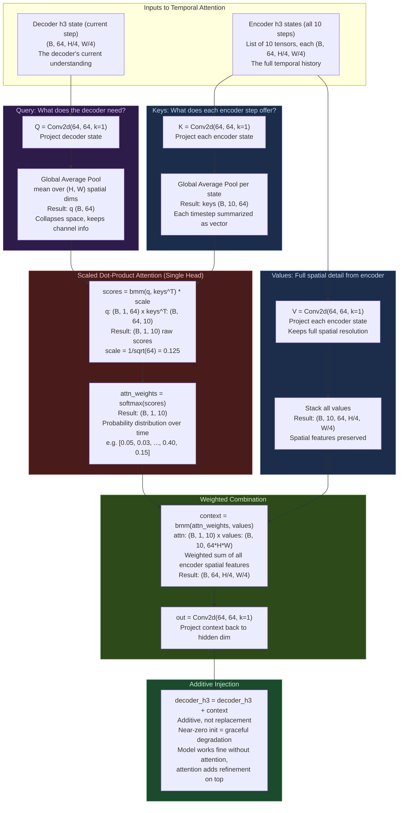

### Temporal Attention Equations

Given decoder hidden state $h^{dec} \in \mathbb{R}^{B \times C \times H \times W}$ and encoder hidden states $\{h^{enc}_1, \ldots, h^{enc}_T\}$:

**Projections** (1x1 Conv2d, learned):

$$Q = W_Q \ast h^{dec}, \quad K_t = W_K \ast h^{enc}_t, \quad V_t = W_V \ast h^{enc}_t$$

**Global Average Pooling** (collapse spatial dims for lightweight attention):

$$\bar{q} = \frac{1}{HW}\sum_{i,j} Q_{:,:,i,j} \in \mathbb{R}^{B \times d}, \quad \bar{k}_t = \frac{1}{HW}\sum_{i,j} K_{t,:,:,i,j} \in \mathbb{R}^{B \times d}$$

**Scaled Dot-Product Attention** (single head, not multi-head):

$$\alpha_t = \text{softmax}\left(\frac{\bar{q} \cdot \bar{k}_t}{\sqrt{d}}\right) \in \mathbb{R}^{B \times T}$$

**Weighted Combination** (values retain full spatial resolution):

$$\text{context} = W_{out} \ast \left(\sum_{t=1}^{T} \alpha_t \cdot V_t\right) \in \mathbb{R}^{B \times C \times H \times W}$$

**Additive Injection** (not replacement - graceful degradation):

$$h^{dec}_{out} = h^{dec} + \text{context}$$

Where $d = C = 64$ (proj_dim equals channel count), $T = 10$ input timesteps, and $\ast$ denotes convolution.

**Why temporal attention?** The decoder needs to "look back" at the full encoder history to decide which past patterns are relevant for the current prediction step. Without it, the decoder only has the final encoder hidden state (a lossy summary). With it, the decoder can selectively retrieve spatial features from any of the 10 input timesteps - e.g., attending heavily to a timestep where a flux rope was forming.

---

## 6. Self-Attention Memory / SA-ConvLSTM (ARCH-01)

> An enhanced ConvLSTM cell that maintains a separate attention-refined memory state M
> alongside the standard LSTM states (h, c). Uses **channel attention** (not spatial attention)
> to keep computation tractable at the model's spatial resolution.

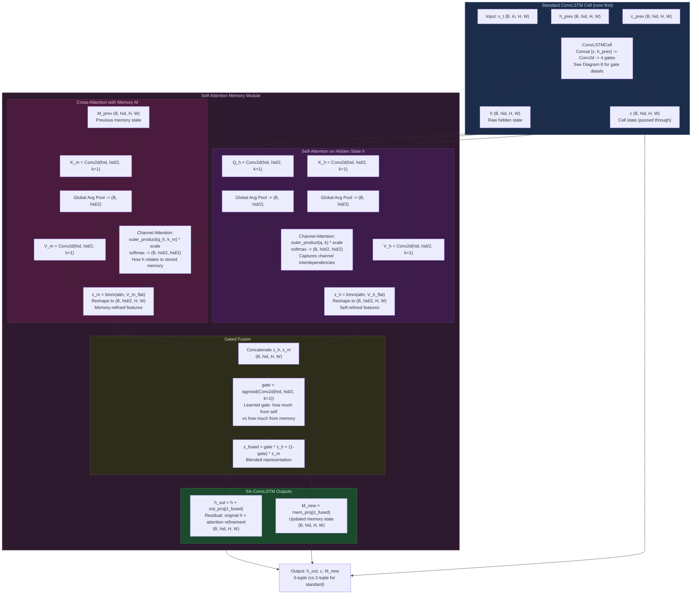

### SA-ConvLSTM Equations

Given hidden state $h \in \mathbb{R}^{B \times C \times H \times W}$ and previous memory $M_{t-1} \in \mathbb{R}^{B \times C \times H \times W}$:

**Step 1: Standard ConvLSTM** (produces raw $h$, $c$):

$$h, c = \text{ConvLSTMCell}(x_t, h_{t-1}, c_{t-1})$$

**Step 2: Self-Attention on $h$** (channel attention, NOT spatial):

$$Q_h = W_Q \ast h, \quad K_h = W_K \ast h, \quad V_h = W_V \ast h \quad \text{(1x1 Conv2d, } C \to C/2\text{)}$$

$$\bar{q}_h = \text{GAP}(Q_h) \in \mathbb{R}^{B \times C/2}, \quad \bar{k}_h = \text{GAP}(K_h) \in \mathbb{R}^{B \times C/2}$$

$$A_h = \text{softmax}\left(\bar{q}_h \cdot \bar{k}_h^\top \cdot \frac{1}{\sqrt{C/2}}\right) \in \mathbb{R}^{B \times C/2 \times C/2}$$

$$z_h = A_h \cdot \text{reshape}(V_h) \in \mathbb{R}^{B \times C/2 \times H \times W}$$

**Step 3: Cross-Attention with Memory $M_{t-1}$** (same query $\bar{q}_h$, keys/values from $M$):

$$K_m = W_{K_m} \ast M_{t-1}, \quad V_m = W_{V_m} \ast M_{t-1}$$

$$A_m = \text{softmax}\left(\bar{q}_h \cdot \text{GAP}(K_m)^\top \cdot \frac{1}{\sqrt{C/2}}\right) \in \mathbb{R}^{B \times C/2 \times C/2}$$

$$z_m = A_m \cdot \text{reshape}(V_m) \in \mathbb{R}^{B \times C/2 \times H \times W}$$

**Step 4: Gated Fusion** (learned gate balances self vs memory):

$$g = \sigma\left(W_g \ast [z_h \| z_m]\right) \in [0, 1]^{B \times C/2 \times H \times W}$$

$$z_{fused} = g \odot z_h + (1 - g) \odot z_m$$

**Step 5: Output** (residual connection on $h$, fresh projection for $M$):

$$h_{out} = h + W_{out} \ast z_{fused}, \quad M_t = W_{mem} \ast z_{fused}$$

Where GAP = Global Average Pooling, $\sigma$ = sigmoid, $\|$ = channel concatenation, $\odot$ = element-wise multiply.

**Why channel attention instead of spatial?** At the latent resolution (110x221), spatial attention would create 24,310 x 24,310 = ~591M element attention matrices per sample. Channel attention operates on $C/2$ channels (16-64), producing tiny matrices (e.g. 32x32 = 1,024 elements) that are trivially cheap.

**Why a separate memory M?** The LSTM cell state $c$ is tightly coupled to the forget/input gating mechanism. Adding a separate memory $M$ gives the model an independent long-term storage that is updated purely through attention, allowing it to retain patterns across many timesteps without gate interference.

---

## 7. Attention Gate on Skip Connections (ARCH-03)

> Based on Attention U-Net (Oktay et al., 2018). Produces a spatial attention mask
> that filters the encoder's skip features before they reach the decoder.

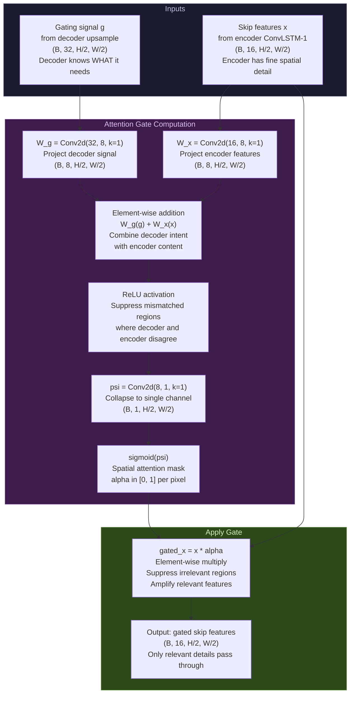

### Attention Gate Equations

Given decoder gating signal $g \in \mathbb{R}^{B \times C_d \times H \times W}$ and encoder skip features $x \in \mathbb{R}^{B \times C_e \times H \times W}$:

$$\psi = \sigma\left(W_\psi \ast \text{ReLU}\left(W_g \ast g + W_x \ast x\right)\right) \in [0, 1]^{B \times 1 \times H \times W}$$

$$\hat{x} = \psi \odot x$$

Where $W_g: C_d \to F_{int}$, $W_x: C_e \to F_{int}$, $W_\psi: F_{int} \to 1$ are 1x1 Conv2d projections, $F_{int} = \max(C_e / 2, 8) = 8$, $\sigma$ is sigmoid, and $\odot$ is element-wise multiplication. The output $\hat{x}$ has the same shape as $x$ but with irrelevant spatial regions suppressed toward zero.

**Why gate skip connections?** Without gating, the skip connection dumps ALL encoder features into the decoder equally. Most of these features are background solar surface with no flare activity. The attention gate lets the decoder signal which spatial regions are important for the current prediction, suppressing background noise and focusing reconstruction effort on active regions.

---

## 8. ConvLSTM Cell Internals

> The fundamental building block. Replaces LSTM's matrix multiplications with 2D convolutions
> so spatial structure (H, W) is preserved while temporal dynamics are modeled.

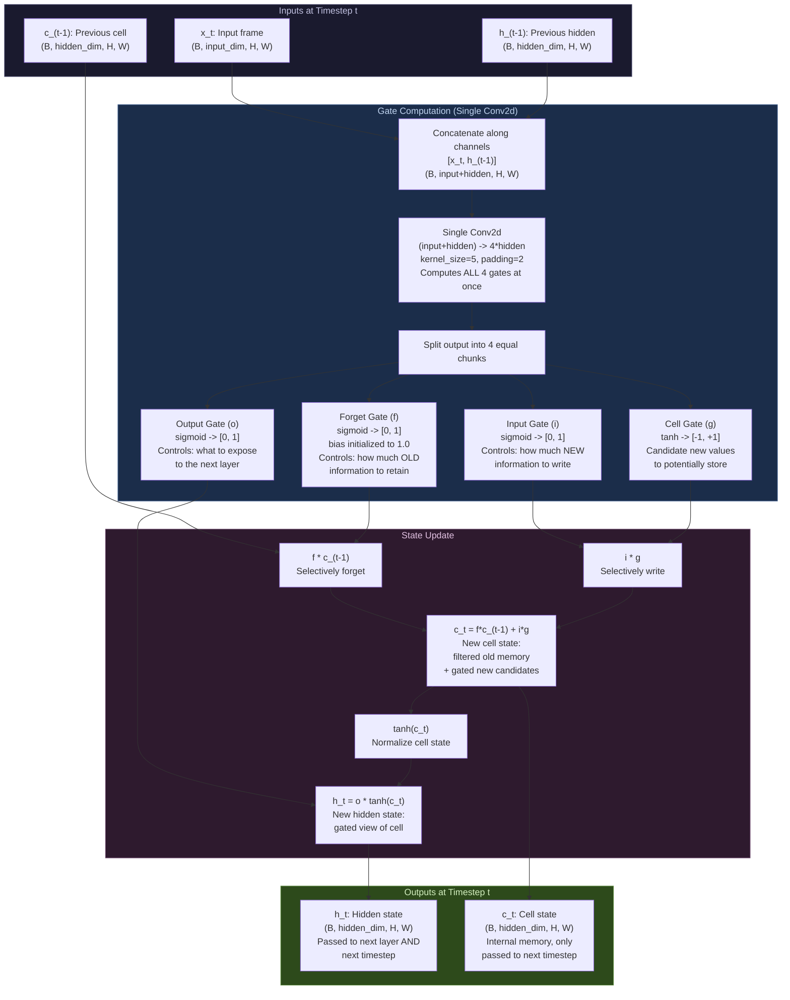

### ConvLSTM Cell Equations

Given input $x_t \in \mathbb{R}^{B \times C_{in} \times H \times W}$, previous hidden state $h_{t-1} \in \mathbb{R}^{B \times C_h \times H \times W}$, and previous cell state $c_{t-1} \in \mathbb{R}^{B \times C_h \times H \times W}$:

**Single convolution computes all four gates:**

$$[i \; f \; g \; o] = \text{Conv2d}_{k \times k}\left([x_t \| h_{t-1}]\right) \in \mathbb{R}^{B \times 4C_h \times H \times W}$$

Where $\|$ denotes channel-wise concatenation, input channels = $C_{in} + C_h$, and $k = 5$.

**Gate activations:**

$$i_t = \sigma\left(W_i \ast [x_t \| h_{t-1}]\right) \quad \text{(Input gate: what to write)}$$

$$f_t = \sigma\left(W_f \ast [x_t \| h_{t-1}] + b_f\right) \quad \text{(Forget gate: what to keep, } b_f = 1.0\text{)}$$

$$g_t = \tanh\left(W_g \ast [x_t \| h_{t-1}]\right) \quad \text{(Cell gate: candidate values)}$$

$$o_t = \sigma\left(W_o \ast [x_t \| h_{t-1}]\right) \quad \text{(Output gate: what to expose)}$$

**State updates:**

$$c_t = f_t \odot c_{t-1} + i_t \odot g_t$$

$$h_t = o_t \odot \tanh(c_t)$$

Where $\sigma$ is sigmoid, $\odot$ is element-wise (Hadamard) product, and $\ast$ denotes 2D convolution. All operations preserve the spatial dimensions $(H, W)$.

**Why Conv instead of Dense?** A standard LSTM flattens the 2D image into a 1D vector, destroying spatial relationships. ConvLSTM applies 2D convolutions, so the gate computations happen locally at each spatial position. A pixel's input gate is influenced by its 5x5 neighborhood, naturally modeling local magnetic field interactions.

**Why $b_f = 1.0$?** Initializing the forget gate bias to 1.0 means $f_t$ starts near $\sigma(1) \approx 0.73$, biased toward remembering. This prevents the common failure mode of LSTMs forgetting everything early in training before useful gradients arrive.

---

## 9. Composite Loss Function

> 6 loss components, each targeting a different failure mode. The total is their weighted sum.

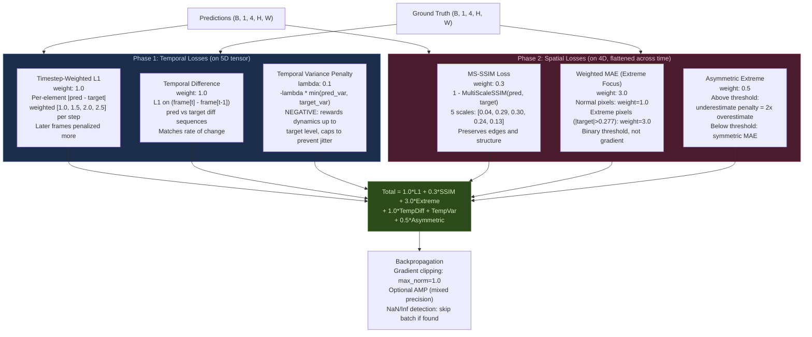

### Loss Function Equations

**1. Timestep-Weighted L1 (MAE):**

$$\mathcal{L}_{L1} = \frac{1}{BTHW} \sum_{b,t,h,w} w_t \cdot |\hat{y}_{b,t,h,w} - y_{b,t,h,w}|$$

Where $w_t = [1.0, 1.5, 2.0, 2.5]$ are per-timestep weights (later predictions penalized more).

**2. Multi-Scale SSIM:**

$$\mathcal{L}_{SSIM} = 1 - \prod_{s=1}^{5} \text{SSIM}_s(\hat{y}, y)^{\beta_s}$$

$$\text{SSIM}(x, y) = \frac{(2\mu_x\mu_y + C_1)(2\sigma_{xy} + C_2)}{(\mu_x^2 + \mu_y^2 + C_1)(\sigma_x^2 + \sigma_y^2 + C_2)}$$

Where $C_1 = (0.01 \cdot R)^2$, $C_2 = (0.03 \cdot R)^2$, $R = 2.0$ (data range), $\beta = [0.0448, 0.2856, 0.3001, 0.2363, 0.1333]$. Statistics computed via Gaussian-windowed Conv2d ($k=11$, $\sigma=1.5$).

**3. Weighted MAE (Extreme Focus):**

$$\mathcal{L}_{extreme} = \frac{1}{N} \sum_{i} w_i \cdot |\hat{y}_i - y_i|, \quad w_i = \begin{cases} 3.0 & \text{if } |y_i| > \tau \\ 1.0 & \text{otherwise} \end{cases}$$

Where $\tau = 0.277$ (extreme threshold in normalized space).

**4. Temporal Difference:**

$$\mathcal{L}_{td} = \frac{1}{(T-1)HW} \sum_{t=2}^{T} \left| (\hat{y}_t - \hat{y}_{t-1}) - (y_t - y_{t-1}) \right|$$

**5. Temporal Variance Penalty:**

$$\mathcal{L}_{tv} = -\lambda \cdot \min\left(\text{Var}_{pred}, \text{Var}_{target}\right)$$

$$\text{Var} = \frac{1}{(T-1)HW} \sum_{t=2}^{T} |y_t - y_{t-1}|$$

Where $\lambda = 0.1$. The negative sign rewards variation; capping at target variance prevents rewarding jitter.

**6. Asymmetric Extreme:**

$$\mathcal{L}_{asym} = \frac{1}{N} \sum_{i} \begin{cases} \alpha \cdot (y_i - \hat{y}_i)^+ + ({\hat{y}_i - y_i})^+ & \text{if } |y_i| > \tau \\ |\hat{y}_i - y_i| & \text{otherwise} \end{cases}$$

Where $\alpha = 2.0$ (underestimation penalty multiplier), $(x)^+ = \max(0, x)$.

**Total Composite Loss:**

$$\mathcal{L} = 1.0 \cdot \mathcal{L}_{L1} + 0.3 \cdot \mathcal{L}_{SSIM} + 3.0 \cdot \mathcal{L}_{extreme} + 1.0 \cdot \mathcal{L}_{td} + \mathcal{L}_{tv} + 0.5 \cdot \mathcal{L}_{asym}$$

**Why 6 losses?** Each addresses a specific failure mode:
- **L1 alone** produces blurry averages (minimizes pixel error by predicting the mean)
- **SSIM** forces structural preservation (edges, contrast, luminance)
- **Extreme weight** prevents the model from ignoring rare flare pixels (which are <1% of area)
- **Temporal diff** prevents static predictions that just copy the last frame
- **Temporal var** actively rewards dynamics (L1+SSIM can still prefer frozen frames)
- **Asymmetric** encodes the domain truth: missing a flare is worse than a false alarm

---

## 10. Training Loop & Evaluation

> The full training cycle including teacher forcing schedule and evaluation metrics.

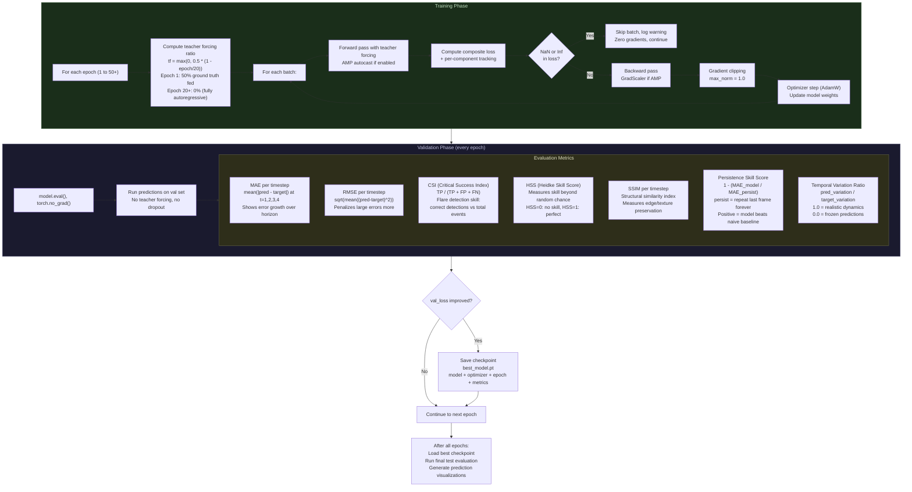

### Teacher Forcing Schedule

$$p_{tf}(e) = \max\left(0, \; 0.5 \cdot \left(1 - \frac{e}{E_{decay}}\right)\right)$$

Where $e$ is the current epoch, $E_{decay} = 20$ is the decay horizon. At each decoder step, with probability $p_{tf}$ the ground truth frame is fed as input instead of the model's own prediction. This decays linearly from 50% to 0% over the first 20 epochs, after which the decoder runs fully autoregressively.

### Evaluation Metric Equations

**MAE** (Mean Absolute Error, per timestep):

$$\text{MAE}_t = \frac{1}{BHW}\sum_{b,h,w} |\hat{y}_{b,t,h,w} - y_{b,t,h,w}|$$

**RMSE** (Root Mean Square Error):

$$\text{RMSE}_t = \sqrt{\frac{1}{BHW}\sum_{b,h,w} (\hat{y}_{b,t,h,w} - y_{b,t,h,w})^2}$$

**CSI** (Critical Success Index) for flare detection at threshold $\tau$:

$$\text{CSI} = \frac{TP}{TP + FP + FN}$$

Where $TP$ = correctly predicted extreme pixels, $FP$ = false alarms, $FN$ = missed extremes.

**HSS** (Heidke Skill Score) - skill relative to random chance:

$$\text{HSS} = \frac{2(TP \cdot TN - FP \cdot FN)}{(TP+FN)(FN+TN) + (TP+FP)(FP+TN)}$$

$\text{HSS} = 0$: no skill (random), $\text{HSS} = 1$: perfect.

**Persistence Skill Score** - improvement over naive "repeat last frame" baseline:

$$\text{PSS} = 1 - \frac{\text{MAE}_{model}}{\text{MAE}_{persistence}}, \quad \text{where } \hat{y}^{persist}_t = x_{T_{in}} \;\forall\; t$$

$\text{PSS} > 0$: model is better than persistence. $\text{PSS} < 0$: model is worse.

**Temporal Variation Ratio:**

$$\text{TVR} = \frac{\sum_t |\hat{y}_t - \hat{y}_{t-1}|}{\sum_t |y_t - y_{t-1}|}$$

$\text{TVR} = 1.0$: realistic dynamics. $\text{TVR} \to 0$: static/frozen predictions.

---

## 11. Module Dependency Map

> How the source files connect. Arrows show import/usage dependencies.

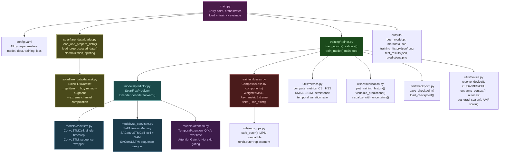

---

## 12. Design Decision Tree

> Traces from the core problem to each architectural choice, explaining **why**.

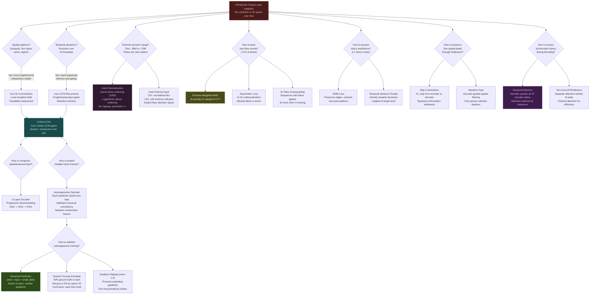
