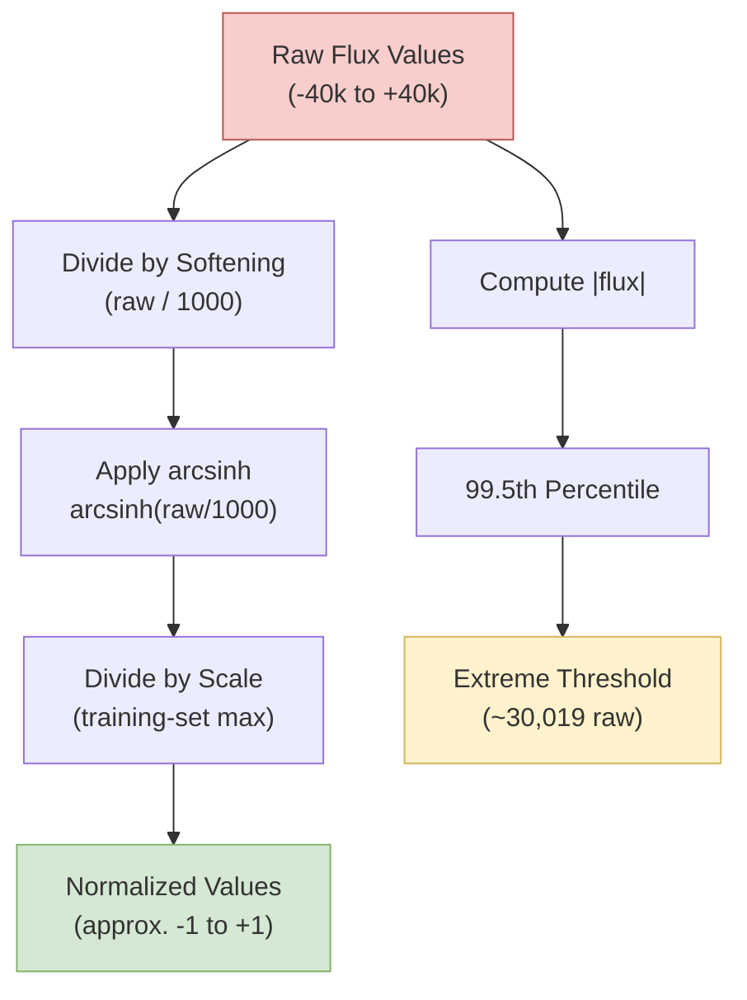
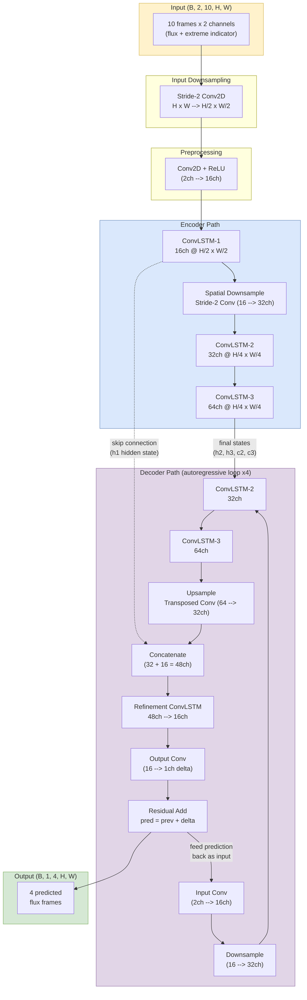
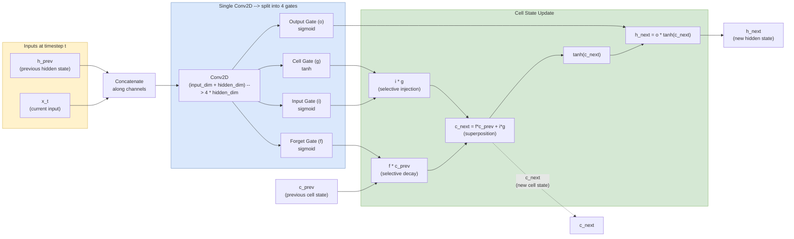
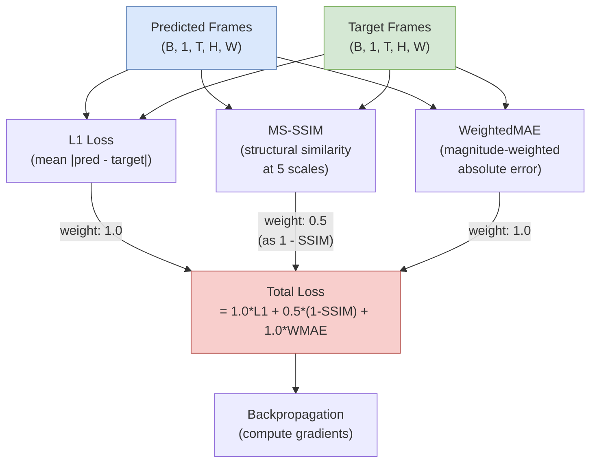

# SolarFlare Model Architecture: A Complete Guide

## 1. Overview

The SolarFlare prediction system is a neural network that forecasts future solar magnetic
winding flux maps from historical observations. Given 10 consecutive snapshots of an active
region's winding flux (spanning roughly 40--60 hours at a 4--6 hour observation cadence), the
model predicts the next 4 frames -- projecting approximately 16--24 hours into the future.

The model is a **ConvLSTM encoder-decoder** -- a class of neural networks designed
specifically for spatiotemporal data (data that varies in both space and time). The encoder
reads the input sequence and compresses it into a compact internal representation. The decoder
then generates future frames one at a time, each prediction feeding into the next.

Think of this as a numerical weather model, but instead of solving partial differential
equations on a grid, the model *learns* the evolution operator from data. Where a traditional
simulation requires explicit knowledge of the governing equations, this model discovers the
effective dynamics directly from observed winding flux sequences.

### Full Pipeline at a Glance

The complete prediction pipeline flows through six stages, from raw data files to output
predictions:

```mermaid
flowchart LR
    A["Raw .npy Files\n(structured arrays)"] --> B["Normalization\n(asinh transform)"]
    B --> C["Sliding Windows\n(10 in + 4 out)"]
    C --> D["ConvLSTM Encoder\n(compress history)"]
    D --> E["ConvLSTM Decoder\n(autoregressive)"]
    E --> F["Residual Prediction\n(prev + delta)"]
    F --> G["Output Frames\n(4 future maps)"]

    style A fill:#e8d5b7,stroke:#8b6914
    style B fill:#d5e8d4,stroke:#82b366
    style C fill:#d5e8d4,stroke:#82b366
    style D fill:#dae8fc,stroke:#6c8ebf
    style E fill:#dae8fc,stroke:#6c8ebf
    style F fill:#f8cecc,stroke:#b85450
    style G fill:#f8cecc,stroke:#b85450
```



**Figure 1.** End-to-end prediction pipeline. Data preparation (gold/green) feeds into the
neural network (blue), which produces predictions via residual computation (red).

---

## 2. Data Pipeline

The data pipeline transforms raw solar observations into the tensor format the neural network
requires. This involves three stages: ingestion, normalization, and windowing.

### 2a. Raw Data Ingestion

Each data file is a NumPy structured array (`.npy` format) containing four fields:

| Field       | Description                                      |
|-------------|--------------------------------------------------|
| `X`         | Horizontal grid coordinate                       |
| `Y`         | Vertical grid coordinate                         |
| `time`      | Observation timestamp                            |
| `windTotal` | Magnetic winding flux value at that grid point   |

Each file represents one active region observation campaign -- a series of winding flux
measurements taken across a spatial grid at regular time intervals.

**Conversion to dense cubes.** The raw structured arrays are sparse -- they list (X, Y, time,
value) tuples. The loader converts these into dense three-dimensional arrays of shape
`(T, H, W)` where `T` is the number of timesteps, `H` is the grid height, and `W` is the
grid width. This conversion is performed by `_structured_to_cube()` in
`solarflare_data/loader.py`, which maps each unique (X, Y, time) coordinate to an index and
fills a pre-allocated array.

Each `.npy` file is like a time-lapse movie of the magnetic winding flux across one active
region, sampled every 4--6 hours. The spatial grid captures the two-dimensional structure of
the flux distribution, while the time axis records how that distribution evolves.

**Pre-flight validation.** Before any training begins, the system performs a memory-mapped
scan of all data files (`_preflight_scan_npy()`). This checks that each file is a valid
structured array containing all four required fields. If more than 10% of files fail
validation, loading aborts entirely. This catches corrupted or malformatted files before they
can cause cryptic errors during training -- analogous to a pre-launch systems check.

### 2b. Normalization (Asinh Transform)

**Why normalize?** Raw winding flux values span an enormous range, roughly -40,000 to
+40,000 in physical units. Neural networks learn most effectively when input values are of
order unity -- that is, roughly between -1 and +1. Without normalization, the network's
internal arithmetic would be dominated by the largest values, and the learning process would
be numerically unstable.

**The asinh transform.** The system uses an inverse hyperbolic sine (asinh) normalization:

```
normalized = arcsinh(raw / softening) / scale
```

where `softening = 1000` and `scale` is computed from the training data.

The key property of arcsinh is that it behaves like the natural logarithm for large values
(`arcsinh(x) ~ ln(2x)` for `|x| >> 1`) but passes smoothly through zero
(`arcsinh(0) = 0`). Unlike a logarithmic transform, it handles negative values naturally
and does not diverge at zero.

The asinh transform is analogous to a logarithmic detector response -- it compresses the
dynamic range so that both quiet-sun regions and intense flare sites are represented on a
comparable scale, much like a CCD with a logarithmic response curve. A quiet region with
flux ~10 and an intense region with flux ~30,000 both end up as moderate normalized values,
allowing the network to "see" structure at all magnitudes simultaneously.

**Training-only statistics.** Normalization parameters (the scale factor) are computed from
training data only. This prevents data leakage -- using validation or test statistics would
give the model indirect information about unseen data. The scale is the asinh of the maximum
absolute flux in the training set, clamped to a minimum of 1.0.

**Extreme threshold.** The 99.5th percentile of absolute flux values defines the "extreme
event" threshold (~30,019 in raw units for the current dataset). This threshold is used
downstream to construct the dual-channel input (Section 2c).



**Figure 2.** Normalization pipeline. The main path (left) compresses the dynamic range via
asinh. A parallel path computes the extreme event threshold from the raw data distribution.

### 2c. Sliding Windows and Dual-Channel Input

**Sliding windows.** From each dense cube of `T` timesteps, the system extracts overlapping
windows of `t_in + t_out = 14` consecutive frames. The first 10 frames become the model's
input; the last 4 become the prediction target. With a stride of 1 (the default), consecutive
windows overlap by 13 frames, maximizing the number of training examples from limited data.

The sliding window is like moving a temporal observation window across a long time series --
analogous to selecting 14-frame segments from a continuous solar observation for analysis.
Each window is an independent training example: "given these 10 snapshots, predict the next
4."

**Whole-file splitting.** Entire files are assigned to train, validation, or test sets (70%,
20%, 10% by default). A file is never split across sets. This prevents temporal leakage --
if consecutive windows from the same file appeared in both training and test, the model could
exploit the overlap rather than learning genuine dynamics. The assignment is seeded for
reproducibility.

**Dual-channel mode.** When enabled (the default configuration), each input frame has two
channels:

- **Channel 1: Normalized flux.** The asinh-transformed winding flux values.
- **Channel 2: Extreme event indicator.** A soft mask highlighting regions where `|flux|`
  exceeds the extreme threshold. Computed as a sigmoid function centered on the threshold:

  ```
  indicator = sigmoid(2 * (|flux| - threshold) / (0.5 * threshold))
  ```

  This produces values near 0 for quiet regions and near 1 for extreme regions, with a
  smooth transition around the threshold.

The dual channel is like giving the model both the raw magnetogram AND a binary mask
highlighting strong-field regions. Channel 1 provides the full flux information; Channel 2
provides an explicit "attention hint" telling the model where extreme activity is occurring.
Without this hint, the model must discover the significance of high-flux regions entirely on
its own -- a harder learning problem.

**Augmentation.** The system supports spatial augmentation (horizontal flips, vertical flips,
rotations) to increase the effective dataset size. With "balanced" augmentation (flips only),
each window generates 3 variants (original, h-flip, v-flip), tripling the training set.
Flux evolution does not depend on spatial orientation, so these transformations preserve the
physical content of each sequence. The current configuration uses no augmentation.

---

## 3. Model Architecture

### 3a. Overview: Encoder-Decoder Architecture

The SolarFlare predictor is an encoder-decoder neural network with three key structural
ideas:

1. **The encoder** reads 10 input frames and compresses the spatiotemporal information into
   a latent representation -- the model's "understanding" of the current state and recent
   dynamics. This is analogous to projecting a complex physical state onto its most relevant
   modes (like decomposing a wave field into its dominant Fourier components).

2. **The decoder** generates 4 future frames one at a time, using the encoder's final state
   as its initial condition. Each predicted frame feeds into the next prediction step. This
   is analogous to a time-stepping scheme where each step depends on the previous solution.

3. **Skip connections** pass high-resolution spatial information from the encoder directly
   to the decoder, bypassing the compressed bottleneck. This is analogous to retaining
   fine-scale detail that would be lost in a coarse-grained simulation.

The encoder-decoder structure mirrors a two-step physical process: (1) analyze the current
state by extracting the essential degrees of freedom (encoder = projection onto relevant
modes), then (2) propagate forward in time using those modes (decoder = time evolution
operator). The skip connection is like retaining high-frequency spatial detail that the
coarse-grained representation would lose -- similar to how a multi-scale simulation preserves
fine-scale features via a coupling term.



**Figure 3.** Full encoder-decoder architecture. The encoder (blue) processes 10 input frames
through a hierarchy of ConvLSTM layers with spatial downsampling. The decoder (purple)
generates 4 frames autoregressively, using encoder states for initialization and a skip
connection for spatial detail. Dashed line indicates the skip connection.

### 3b. ConvLSTM Cell: The Core Building Block

The ConvLSTM (Convolutional Long Short-Term Memory) cell is the fundamental computational
unit of the SolarFlare model. To understand it, we need two concepts: convolutions and
recurrent memory.

**Convolution: a learned spatial filter.** A convolution slides a small filter (called a
kernel) across a 2D image, computing a weighted sum at each position. This is directly
analogous to a finite-difference stencil in numerical methods -- but instead of prescribed
coefficients (like the 5-point Laplacian stencil), the coefficients are *learned* from data.
With a kernel size of 3, each output pixel depends on a 3x3 neighborhood of input pixels.
The convolution detects local spatial patterns: edges, gradients, regions of high curvature
in the flux distribution.

**LSTM: selective temporal memory.** An LSTM (Long Short-Term Memory) unit is a recurrent
module that maintains an internal "memory" (the cell state) which persists across timesteps.
At each timestep, four learned operations (called gates) control how this memory is updated:

| Gate          | Symbol | Function                                   | Physics Analogy                        |
|---------------|--------|--------------------------------------------|----------------------------------------|
| **Forget**    | f      | What fraction of old memory to keep        | Exponential decay of a field           |
| **Input**     | i      | What fraction of new information to store  | Source term injecting new values       |
| **Cell**      | g      | What new information to compute            | The actual new value (source content)  |
| **Output**    | o      | What to expose as the current state        | Observable vs. internal state variable |

**ConvLSTM = convolution + LSTM.** In a standard LSTM, the gates are computed via matrix
multiplications (dense linear layers). In a ConvLSTM, the gates are computed via 2D
convolutions. This means the memory is not a single vector but a **2D spatial field** -- each
grid point has its own independent memory that interacts with its spatial neighbors through
the convolution kernel.

The cell state update follows:

```
c_next = f * c_prev + i * g
h_next = o * tanh(c_next)
```

where `*` denotes element-wise multiplication (at every spatial point independently). The new
cell state is a linear combination of the old state (scaled by the forget gate) and new
information (scaled by the input gate). This is a superposition of old and new states --
analogous to the superposition principle in linear systems.

The cell state is like a "memory field" -- a 2D field that evolves over time according to
learned dynamics, similar to how a scalar field (such as temperature) evolves under a PDE.
The gates are spatially-varying coefficients that control the evolution at each grid point
independently. The convolution is essentially a local spatial operator (like a discrete
Laplacian or gradient), but instead of having fixed stencil weights, the network learns the
optimal stencil from data.



**Figure 4.** Data flow through one ConvLSTMCell. The input and previous hidden state are
concatenated and passed through a single convolution that produces all four gates
simultaneously. The gates then control the cell state update, producing new cell and hidden
states. All operations preserve the 2D spatial structure.

**Forget bias initialization.** The forget gate bias is initialized to 1.0 (rather than the
typical 0). This means the network starts by remembering everything -- the sigmoid of 1.0 is
about 0.73, so roughly 73% of the memory is retained at each step initially. This ensures
stable initial dynamics where information persists across timesteps, and the network
gradually learns what to forget during training.

**Implementation detail.** All four gates are computed from a single convolution with
`4 * hidden_dim` output channels, then split into four equal parts. This is computationally
efficient -- one convolution instead of four -- and is mathematically equivalent to four
separate convolutions.

### 3c. Channel Hierarchy and Spatial Downsampling

The model uses a hierarchy of increasing channel counts at decreasing spatial resolutions:

| Layer      | Channels | Spatial Resolution | Role                          |
|------------|----------|--------------------|-------------------------------|
| ConvLSTM-1 | 16       | H/2 x W/2         | Fine-scale spatial features   |
| ConvLSTM-2 | 32       | H/4 x W/4         | Medium-scale dynamics         |
| ConvLSTM-3 | 64       | H/4 x W/4         | Broad-scale correlations      |

**Channels** represent the number of independent features the model tracks at each spatial
point. At the first layer, 16 channels might encode features like "local flux gradient,"
"curvature of the flux boundary," or "rate of recent change." Deeper layers, with more
channels, can encode more abstract combinations of these features.

**Spatial downsampling** between ConvLSTM-1 and ConvLSTM-2 is performed by a stride-2
convolution (`nn.Conv2d` with `stride=2`), which reduces each spatial dimension by half.
This simultaneously halves the resolution and increases the channel count from 16 to 32.

This is directly analogous to a multi-resolution analysis or wavelet decomposition. The
first ConvLSTM operates at full resolution (after the input downsampling), capturing fine
spatial structure -- individual flux concentrations, polarity boundaries. After downsampling,
the second ConvLSTM operates at half that resolution, capturing larger-scale dynamics -- the
overall morphology of the active region. The deepest level captures the broadest spatial
correlations with the most feature channels -- like going from local vorticity to
synoptic-scale flow patterns.

### 3d. Autoregressive Decoding

The decoder generates output frames **one at a time**. Each predicted frame becomes the
input for predicting the next frame. This sequential generation is called "autoregressive"
decoding.

**State initialization.** The decoder does not start from scratch. The encoder's final
hidden states (h, c) from ConvLSTM-2 and ConvLSTM-3 are passed directly to the decoder's
corresponding layers. The decoder "inherits" the encoder's understanding of the input
sequence -- it begins with full knowledge of what happened in the past 10 frames.

**For each output step t (t = 1, 2, 3, 4):**

1. **Take the previous frame.** For t=1, this is the last input frame. For t>1, it is the
   model's own prediction from step t-1. The frame includes all channels (flux + extreme
   indicator).

2. **Process through decoder ConvLSTMs.** The frame passes through the decoder's input
   convolution, spatial downsampling, and two ConvLSTM layers (which maintain persistent
   state from previous decoder steps).

3. **Upsample back to encoder resolution.** A transposed convolution increases spatial
   dimensions by 2x, reversing the decoder's internal downsampling.

4. **Concatenate with skip connection.** The upsampled features are concatenated with the
   encoder's first-layer hidden state, combining coarse decoded dynamics with fine spatial
   detail.

5. **Refine through a final ConvLSTM.** A refinement ConvLSTM integrates the combined
   features, producing the final representation for this timestep.

6. **Predict a residual (delta).** An output convolution produces a single-channel "change
   map" -- the predicted difference between this frame and the previous frame.

7. **Add delta to previous frame.** The final prediction is `pred[t] = prev_frame + delta`.
   The model predicts changes, not absolute values.

Autoregressive decoding is like a time-stepping scheme in numerical integration. Each step
uses the result of the previous step as its initial condition -- exactly like a Runge-Kutta
integrator where each step depends on the previous solution. The residual prediction
(`pred = prev + delta`) is analogous to computing perturbations rather than absolute values
-- a technique used throughout physics to improve numerical stability (perturbation theory,
incremental stress formulations, pressure correction methods in CFD).

### 3e. Skip Connections

The encoder's first-layer hidden state `h1_skip` is concatenated with the decoder's
upsampled features before the refinement ConvLSTM. Specifically:

```
dec_concat = concatenate([upsampled_decoder_output, h1_skip], along channels)
```

This produces a tensor with `c2 + c1 = 32 + 16 = 48` channels that the refinement ConvLSTM
(with 48 input channels and 16 output channels) processes into the final representation.

**Why skip connections?** The encoder's deep layers (ConvLSTM-2 and ConvLSTM-3) operate at
reduced spatial resolution with many channels. They capture large-scale temporal dynamics
effectively but lose fine spatial detail in the process. The skip connection "injects" the
original high-resolution spatial structure directly into the decoder's output stage.

Skip connections serve the same purpose as correction terms in a coarse-grained simulation.
The encoder's deep layers capture large-scale dynamics but lose spatial detail. The skip
connection adds back the effect of fine-scale structure -- analogous to subgrid-scale models
in Large Eddy Simulation (LES) of turbulence, where the resolved large scales are corrected
by a model of the unresolved small scales.

### 3f. Input Downsampling and Upsampling

Before any processing, an optional 2x spatial downsampling reduces the input from
`H x W` to `H/2 x W/2`:

```
input_down = Conv2D(input_channels, 16, kernel=4, stride=2, padding=1) + ReLU
```

All internal processing (all ConvLSTM layers, skip connections, decoder operations) happens
at this reduced resolution. The output head then upsamples back to the original resolution
via a transposed convolution:

```
output_up = ConvTranspose2d(16, 16, kernel=4, stride=2, padding=1) + ReLU
output = Conv2D(16, 1, kernel=1)
```

This is equivalent to solving the dynamics on a coarser grid for computational efficiency,
then interpolating back to the fine grid for output -- a standard technique in adaptive mesh
refinement. The trade-off is 4x fewer spatial computations (half in each dimension) at the
cost of some spatial resolution in the model's internal representations. For the current
dataset, this trade-off is favorable -- the 2x reduction eliminates significant memory
pressure while preserving the spatial structures relevant to flux evolution.

---

## 4. Training Process

### 4a. Composite Loss Function

The model is trained by minimizing a composite loss function that combines three complementary
objectives:

```
Total Loss = 1.0 * L1 + 0.5 * (1 - MS-SSIM) + 1.0 * WeightedMAE
```

Each component captures a different aspect of prediction quality:

**L1 Loss (Mean Absolute Error).** The simplest component: the average absolute difference
between predicted and target pixel values, summed over all pixels and timesteps. L1 penalizes
all errors equally regardless of magnitude and is robust to outliers (unlike squared error,
which amplifies large errors quadratically).

**MS-SSIM Loss (Multi-Scale Structural Similarity).** SSIM measures the similarity of
structural patterns (edges, textures, local contrast) between prediction and target. The
"multi-scale" variant computes SSIM at progressively downsampled resolutions, capturing
structural similarity at multiple spatial scales. The loss is `1 - MS-SSIM` so that perfect
structural match (MS-SSIM = 1) gives zero loss. This component prevents blurry predictions:
a blurry output might have low L1 error (it gets the average right) but poor SSIM (it loses
sharp structures).

**WeightedMAE (Weighted Mean Absolute Error).** Standard MAE treats all pixels equally, but
most of the image is quiet-sun (low flux). The model could achieve low L1 by predicting
quiet-sun well and ignoring the small, intense flare regions. WeightedMAE counteracts this
by scaling each pixel's error by its target magnitude: pixels with larger absolute flux values
receive higher penalty weights. The weighting formula is
`weight = base_weight + extreme_weight * (|target| / max|target|)`, with `base_weight = 1.0`
and `extreme_weight = 2.0`.

The composite loss is like a multi-objective cost function in optimization. L1 ensures global
accuracy (like minimizing total energy error). MS-SSIM ensures structural fidelity (like
preserving the topology of field lines). WeightedMAE ensures extreme regions are captured
(like adding a constraint on peak field strength). No single metric captures all aspects of
a good prediction -- the combination drives the model toward outputs that are accurate,
sharp, and attentive to extreme regions simultaneously.



**Figure 5.** Composite loss function. Three independent loss components are computed from
predictions and targets, then combined with fixed weights into a single scalar loss that
drives gradient computation.

### 4b. Optimizer and Scheduling

**AdamW optimizer.** The model uses AdamW, an optimizer that maintains per-parameter adaptive
learning rates with decoupled weight decay. The learning rate is `1e-4` with weight decay
`1e-5`. Weight decay acts as L2 regularization, gently penalizing large parameter values to
prevent overfitting -- analogous to a friction term in a dynamical system that prevents
oscillations from growing unbounded.

**Teacher forcing.** During training, the decoder normally uses its own predictions as input
for the next step. With teacher forcing, the decoder sometimes receives the **ground truth**
previous frame instead of its own prediction. The teacher forcing ratio starts at 0.5 (50%
probability of using ground truth at each step) and decays linearly to 0 over the course of
training.

Teacher forcing is like training wheels. Early in training, the model's predictions are
poor, so feeding them back would compound errors -- like numerical instability in an explicit
time-stepping scheme with a CFL violation. By occasionally providing the correct answer, we
stabilize early learning. As training progresses, we remove this support so the model learns
to be robust to its own errors. The linear decay provides a smooth transition from
"guided practice" to "fully autonomous prediction."

**Learning rate scheduler.** The current configuration uses a constant learning rate (no
scheduler). Optionally, cosine annealing can be enabled, which smoothly decreases the
learning rate from `1e-4` to `1e-6` following a cosine curve over the training epochs. This
allows the optimizer to explore broadly early in training, then fine-tune with smaller steps
in later epochs -- analogous to simulated annealing in optimization, where the "temperature"
decreases over time to allow the system to settle into a local minimum.

### 4c. Training Logistics

**Gradient clipping (max norm 0.5).** Before each parameter update, the total norm of all
gradients is computed and, if it exceeds 0.5, all gradients are uniformly rescaled. This
prevents "exploding gradients" -- a phenomenon where error signals amplify as they propagate
backward through time (similar to numerical instability in iterative methods). The clipping
threshold of 0.5 is relatively aggressive, ensuring tight control over parameter updates.

**NaN detection and abort.** If 10 consecutive training batches produce NaN (not-a-number) or
infinite loss values, training aborts and saves an emergency checkpoint. Individual NaN
batches are skipped without aborting -- they can occur from unusual data samples or numerical
edge cases. The emergency checkpoint preserves all model weights and training state, allowing
investigation and restart from the last good state.

**Early stopping (patience = 8).** If the validation loss does not improve for 8 consecutive
epochs, training stops. This prevents overfitting -- the point where the model starts
memorizing training data rather than learning generalizable patterns. With only 7 data files
and ~568 training samples, overfitting is a real risk, making early stopping essential.

**Checkpointing.** Two checkpoints are maintained:
- **Best model:** The model state with the lowest validation loss seen so far.
- **Latest model:** A rolling checkpoint updated every epoch (previous latest is deleted).
- **Emergency checkpoints:** Saved on NaN abort, SIGINT, or SIGTERM signals.

**Graceful shutdown.** The training loop installs signal handlers for SIGINT (Ctrl+C) and
SIGTERM. On the first signal, the current epoch completes normally and an emergency
checkpoint is saved before exit. A second signal forces immediate exit. This ensures that
interrupting training never results in lost work -- analogous to a safe shutdown procedure
for an instrument that must complete its current measurement before powering down.

**Automatic mixed precision (AMP).** When enabled (currently disabled by default), AMP
performs computations in 16-bit floating point where possible, reducing memory usage and
increasing throughput on CUDA GPUs by approximately 20%. A gradient scaler prevents
underflow in 16-bit gradients. On Apple MPS, AMP provides no benefit and uses a dummy scaler.

---

## 5. Inference and Residual Prediction

At inference time, the model operates with teacher forcing disabled (`teacher_forcing_ratio
= 0`). The decoder relies entirely on its own predictions -- there is no access to ground
truth during inference.

**Residual prediction.** The model predicts residuals (changes) rather than absolute values.
For each decoder step:

```
pred[t] = previous_frame + delta[t]
```

where `delta[t]` is the output of the neural network for step `t`. The first prediction uses
the last input frame as `previous_frame`; subsequent predictions use the model's own output
from the previous step.

Residual prediction is analogous to perturbation theory in physics: rather than computing
the full solution from scratch at each timestep, we compute the deviation from the previous
state. This is numerically more stable and leverages the fact that consecutive frames are
highly correlated -- the "background" changes slowly, and only the perturbation needs to be
predicted with high precision.

**Multi-channel handling.** The model accepts 2-channel input (flux + extreme indicator) but
outputs only 1 channel (flux). During autoregressive decoding, when the model's predicted
flux becomes the input for the next step, the extreme indicator channel is recomputed from
the predicted flux values. This ensures the extreme indicator always reflects the current
prediction rather than stale input data.

**Uncertainty quantification (MC Dropout).** When `dropout_rate > 0` (currently 0.0, meaning
disabled), dropout layers in the encoder and decoder randomly zero out a fraction of activations.
During inference, if the model is kept in training mode (dropout active), running inference
multiple times produces a distribution of predictions. The spread of this distribution
indicates model uncertainty: regions where predictions vary widely across runs are regions
where the model is less confident.

MC Dropout uncertainty is analogous to ensemble forecasting in weather prediction -- by
introducing controlled stochastic perturbations into the model, we sample the space of
possible predictions to estimate confidence bounds. A region of high uncertainty might
indicate a pre-flare state where the evolution is inherently unpredictable, which is itself
valuable information for forecasting.

---

## 6. Current Configuration Summary

The following table summarizes all key hyperparameters from `config.yaml`:

### Data Configuration

| Parameter             | Value               | Description                                      |
|-----------------------|---------------------|--------------------------------------------------|
| `t_in`                | 10                  | Input sequence length (frames)                   |
| `t_out`               | 4                   | Output prediction length (frames)                |
| `dual_channel`        | true                | Flux + extreme indicator channels                |
| `augmentation`        | none                | No spatial augmentation                          |
| `stride`              | 1                   | Sliding window stride (max overlap)              |
| `split_ratios`        | [0.7, 0.2, 0.1]    | Train / test / val file split                    |
| `num_workers`         | 0                   | Data loading in main process                     |

### Normalization Configuration

| Parameter                       | Value   | Description                              |
|---------------------------------|---------|------------------------------------------|
| `method`                        | asinh   | Inverse hyperbolic sine transform        |
| `asinh_softening`               | 1000.0  | Softening parameter (dynamic range)      |
| `extreme_threshold_percentile`  | 99.5    | Percentile for extreme event detection   |

### Model Configuration

| Parameter           | Value          | Description                                  |
|---------------------|----------------|----------------------------------------------|
| `input_channels`    | 2              | Flux + extreme indicator                     |
| `output_channels`   | 1              | Flux prediction only                         |
| `channels`          | [16, 32, 64]   | Channel progression (encoder1, encoder2, latent) |
| `kernel_size`       | 3              | ConvLSTM kernel size (3x3 receptive field)   |
| `downsample_input`  | true           | 2x spatial downsampling at input             |
| `use_checkpointing` | false          | Gradient checkpointing disabled              |
| `dropout_rate`      | 0.0            | MC Dropout disabled                          |

### Training Configuration

| Parameter       | Value    | Description                                       |
|-----------------|----------|---------------------------------------------------|
| `batch_size`    | 1        | Single sample per batch (large spatial dims)       |
| `epochs`        | 25       | Maximum training epochs                            |
| `lr`            | 1e-4     | Learning rate                                      |
| `weight_decay`  | 1e-5     | L2 regularization strength                         |
| `tf_start`      | 0.5      | Initial teacher forcing ratio                      |
| `patience`      | 8        | Early stopping patience (epochs)                   |
| `grad_clip`     | 0.5      | Gradient clipping max norm                         |
| `use_amp`       | false    | Automatic mixed precision disabled                 |
| `scheduler`     | none     | Constant learning rate                             |

### Loss Configuration

| Parameter           | Value      | Description                                  |
|---------------------|------------|----------------------------------------------|
| `type`              | composite  | Combined L1 + SSIM + WeightedMAE             |
| `l1_weight`         | 1.0        | L1 loss coefficient                          |
| `ssim_weight`       | 0.5        | SSIM loss coefficient                        |
| `extreme_weight`    | 1.0        | WeightedMAE coefficient                      |
| `use_ms_ssim`       | false      | Single-scale SSIM (not multi-scale)          |
| `ssim_data_range`   | 2.0        | Expected data range for SSIM (normalized)    |

---

## 7. Planned Improvements

The following roadmap describes 23 planned improvements organized into 7 phases, progressing
from simple configuration changes to significant architectural modifications. This section
faithfully reproduces the improvement plan from `.planning/IMPROVEMENT_NOTES.md`.

### Phase A -- Quick Wins (Configuration Changes Only)

These improvements require only changes to `config.yaml`, no code modifications.

**1. Increase extreme_weight to 3.0**
Changes the extreme loss weight from 1.0 to 3.0-5.0.
*Why it matters:* The model optimizes to predict quiet-sun regions well because they cover
most of the image area. Flare regions are spatially tiny. Increasing the extreme weight
forces the model to allocate more capacity toward predicting intense flux regions.
*Priority: High.*

**2. Enable balanced augmentation**
Changes `augmentation` from "none" to "balanced" (horizontal + vertical flips).
*Why it matters:* Triples the effective dataset from ~568 to ~1,704 samples. ConvLSTMs lack
built-in spatial invariance, so flips teach the model that flux evolution is
orientation-independent. Note: augmentation improves spatial diversity but does not create new
temporal dynamics -- the 7 independent evolution trajectories remain the fundamental data
bottleneck.
*Priority: High.*

**3. Enable cosine LR scheduler**
Changes `scheduler.type` from "none" to "cosine" with `cosine_eta_min: 1e-6`.
*Why it matters:* Allows the optimizer to explore broadly early in training, then fine-tune in
later epochs. With a flat LR, the model may oscillate around a minimum instead of settling
into it.
*Priority: Medium.*

**4. Eliminate teacher forcing**
Sets `tf_start` from 0.5 to 0.0.
*Why it matters:* Teacher forcing masks weak temporal dynamics. With tf > 0, the model can
produce a bad t+1 prediction, get corrected by ground truth, and produce a decent t+2 --
hiding that its temporal model is broken. With tf = 0, the model must be robust to its own
autoregressive errors from the start.
*Priority: Medium.*

**5. Shorten input sequence (t_in: 5)**
Changes `t_in` from 10 to 5 or 6 (20-36 hours of history instead of 40-60).
*Why it matters:* The ConvLSTM must compress all input frames into fixed-size hidden states.
Older frames (48-60 hours ago) may dilute the signal from recent frames where predictive
dynamics are most visible. Shorter input means more focused context.
*Priority: Medium (requires empirical testing).*

### Phase B -- Metrics and Evaluation (Code Changes, No Architecture Change)

**6. Wire existing metrics into validation loop**
Calls `compute_rmse`, `compute_correlation`, and per-timestep MAE during validation and logs
them per epoch.
*Why it matters:* Without these, you cannot distinguish "model is learning temporal dynamics"
from "model is doing spatial interpolation." Per-timestep MAE reveals error compounding --
if t+1 and t+4 errors are similar, the model is just copying.
*Priority: High.*

**7. Add Critical Success Index (CSI) and Heidke Skill Score (HSS)**
CSI = TP/(TP+FP+FN) for binarized predictions above extreme threshold.
HSS = 2(TP*TN - FP*FN) / ((TP+FN)(FN+TN) + (TP+FP)(FP+TN)).
*Why it matters:* Standard metrics in space weather forecasting. CSI directly answers "did the
model predict high flux where it actually occurred?" HSS measures improvement over random
chance, exposing a model that always predicts "no flare" (high accuracy, HSS = 0).
*Priority: High.*

**8. Implement persistence baseline comparison**
Computes all metrics for a "persistence" model that predicts the last input frame for all
future steps. Reports model metrics relative to persistence.
*Why it matters:* Persistence is the null hypothesis. If the model cannot beat "just repeat
the last frame," it has not learned dynamics. Every result should be reported as "X%
improvement over persistence."
*Priority: High.*

**9. Log SSIM as standalone validation metric**
Extracts the SSIM value from the composite loss and reports it independently during
validation.
*Why it matters:* SSIM tells you if the model preserves spatial patterns (active region shapes,
polarity boundaries) even when absolute magnitudes are off.
*Priority: Low.*

### Phase C -- Temporal Dynamics (Loss and Input Changes)

The current model produces near-identical predictions across all 4 output steps (per-timestep
MAE spread is only 5%). This indicates the model has learned spatial structure but not
temporal evolution. The residual prediction mechanism + L1 loss creates a strong incentive to
predict near-zero deltas, defaulting to persistence.

**10. Temporal difference loss**
Adds a loss term on the *rate of change*:
`L_diff = L1(pred[t+1] - pred[t], target[t+1] - target[t])`.
*Why it matters:* Forces the model to match how flux evolves between frames, not just absolute
values. The model cannot hide behind static predictions -- if ground truth shows flux
increasing, the model must predict that increase. This is the single most impactful change for
temporal dynamics.
*Priority: Critical.*

**11. Feed temporal differences as input channels**
Computes frame-to-frame differences `diff[t] = frame[t] - frame[t-1]` and concatenates them
as additional input channels.
*Why it matters:* Gives the model direct access to "velocity" -- where flux is
increasing/decreasing and how fast. Currently, the ConvLSTM must discover this implicitly from
raw frames. This is analogous to providing optical flow in video prediction.
*Priority: High.*

**12. Temporal weighting -- penalize later timesteps more**
Applies per-timestep loss weights like `[1.0, 1.5, 2.0, 2.5]` or exponential `[1, 2, 4, 8]`.
*Why it matters:* t+1 is easy (close to persistence) and dominates the gradient. t+4 is where
dynamics matter but contributes equally. Heavier weighting on later steps forces the model to
focus on harder, further-out predictions.
*Priority: Medium.*

**13. Temporal variation penalty**
Adds a regularization term: `L_var = -lambda * mean(|pred[t+1] - pred[t]|)` with small
lambda (0.1-0.3).
*Why it matters:* Explicitly rewards the model for predicting change rather than static output.
Without this, "predict the same thing for all 4 steps" is the safest strategy.
*Priority: Medium.*

### Phase D -- Extreme Region Focus (Loss and Data Pipeline)

**14. Fix WeightedMAE to use absolute threshold**
Changes `WeightedMAE` from per-sample relative normalization to a fixed threshold based on the
pre-computed 99.5th percentile. Applies a fixed multiplier (5-10x) to pixels above threshold.
*Why it matters:* Current implementation normalizes by the per-sample maximum, making the
penalty inconsistent across samples. A frame with a strong flare weights pixels differently
than a frame with a weak one. Fixed threshold makes the signal consistent.
*Priority: High.*

**15. Asymmetric loss penalty**
Penalizes underestimation of high-flux regions more than overestimation: for pixels above
threshold, `loss = alpha * max(0, target - pred) + max(0, pred - target)` where alpha > 1.
*Why it matters:* A missed flare is operationally worse than a false alarm. The model should
err on the side of predicting flares when uncertain.
*Priority: Medium.*

**16. Class-imbalanced sampling (WeightedRandomSampler)**
Tags sequences containing extreme-threshold pixels in target frames, then oversamples them
3-5x.
*Why it matters:* The model overwhelmingly sees quiet-to-quiet transitions. Oversampling
rebalances training focus toward flare buildup sequences -- the highest-impact data-side
improvement.
*Priority: High.*

### Phase E -- Architecture Changes (Significant Code Changes)

**17. Spatial attention gate**
Adds a learned attention mask before the skip connection:
`attention = sigmoid(conv(encoder_features))`, then `skip = skip * attention`.
*Why it matters:* Lets the model learn to focus on active regions rather than processing
quiet-sun uniformly. Well-established technique from Attention U-Net (medical imaging).
*Priority: Medium.*

**18. Increase kernel size or channel capacity**
Either `kernel_size: 5` (wider receptive field) or `channels: [32, 64, 128]` (more features).
*Why it matters:* Kernel size 3 may be too narrow to capture flare precursors that span larger
spatial scales. More channels provide additional representational power. Risk: overfitting
with limited data.
*Priority: Medium.*

**19. Temporal attention over encoder outputs**
Adds attention weights over the encoder's temporal outputs, allowing the decoder to query
which input timesteps are most relevant.
*Why it matters:* Not all 10 input frames are equally predictive. The last 2-3 frames before a
flare contain the most signal. Temporal attention lets the model learn which frames to
emphasize.
*Priority: Medium.*

**20. Delta head normalization**
Normalizes target deltas during training so typical delta magnitude is ~1.0, or adds a
learnable scale parameter to the output head.
*Why it matters:* Typical delta magnitudes are ~0.01, a poor numerical range where near-zero
is always safe. Rescaling makes non-trivial deltas easier to learn. This is like choosing
natural units in physics -- putting the characteristic scale at O(1).
*Priority: High.*

**21. Enable MC Dropout (0.1-0.2)**
Sets `dropout_rate: 0.1-0.2` and enables uncertainty estimation during inference.
*Why it matters:* For flare prediction, confidence is as important as the prediction itself.
Also acts as regularization during training. Similar to ensemble methods in weather
forecasting.
*Priority: Low.*

### Phase F -- Training Curriculum (Multi-Stage)

**22. Progressive temporal training (t_out: 1 -> 2 -> 4)**
Trains in stages: first single-step prediction, then two-step, then four-step. Each stage
loads the best checkpoint from the previous stage.
*Why it matters:* 4-step autoregressive prediction from scratch is hard -- early in training,
the t+4 gradient signal is noise. Starting with t_out = 1 lets the model first learn reliable
single-step dynamics before extending. Established technique in sequence-to-sequence training.
*Priority: Medium.*

### Phase G -- Data Acquisition (External)

**23. Acquire more winding flux data cubes**
Obtain 2-3 additional winding flux data files.
*Why it matters:* The single highest-impact improvement possible. No amount of augmentation or
architectural changes substitutes for more independent temporal sequences. Each new file
provides genuinely new flux evolution dynamics the model has never seen. Currently the system
has 7 files -- even doubling to 14 would be transformative.
*Priority: Critical (but external dependency).*

### Priority Order Summary

| Priority | Phase | Items                          | Effort       |
|----------|-------|--------------------------------|--------------|
| 1        | A     | Config changes (5 items)       | Minutes      |
| 2        | B     | Metrics/evaluation (4 items)   | 1-2 days     |
| 3        | C     | Temporal dynamics (4 items)    | 2-3 days     |
| 4        | D     | Extreme focus (3 items)        | 1-2 days     |
| 5        | E     | Architecture (5 items)         | 3-5 days     |
| 6        | F     | Curriculum training (1 item)   | 1 day        |
| 7        | G     | Data acquisition (1 item)      | External     |

---

## 8. Glossary

Key machine learning terms used in this document, with physics analogies:

| Term                  | Definition                                                                                               | Physics Analogy                                                              |
|-----------------------|----------------------------------------------------------------------------------------------------------|------------------------------------------------------------------------------|
| **Epoch**             | One complete pass through the entire training dataset.                                                   | One full sweep of the parameter space in a systematic search.                |
| **Batch**             | A subset of training samples processed together before updating model parameters.                        | Processing a group of measurements simultaneously for a single update.       |
| **Gradient**          | The vector of partial derivatives of the loss with respect to each model parameter. Points toward increasing loss. | The gradient of a potential function -- indicates the direction of steepest ascent. The optimizer moves opposite to it. |
| **Loss**              | A scalar quantity measuring how far the model's predictions are from the truth. Lower is better.         | A cost function or energy functional to be minimized.                        |
| **Convolution**       | A linear operation that slides a small learned filter across a 2D field, computing weighted local sums.  | A finite-difference stencil with learned (not prescribed) coefficients.      |
| **LSTM**              | A recurrent unit with gated memory that selectively remembers, forgets, and outputs information across timesteps. | A dynamical system with state variables governed by learned update rules.    |
| **Latent space**      | The compressed internal representation produced by the encoder.                                          | The reduced set of relevant modes after projecting out noise and irrelevant degrees of freedom. |
| **Skip connection**   | A direct link that passes information from an early layer to a later layer, bypassing intermediate processing. | A correction term that adds back fine-scale detail lost in coarse-graining.  |
| **Residual**          | The predicted difference (delta) between consecutive frames, rather than the absolute value.             | A perturbation expansion: computing the deviation from a known baseline.     |
| **Teacher forcing**   | During training, occasionally providing the ground truth previous frame to the decoder instead of its own prediction. | Training wheels that stabilize early learning by preventing error compounding. |
| **Early stopping**    | Halting training when validation performance stops improving, to prevent memorizing training data.        | Stopping an iterative solver when the residual stops decreasing.             |
| **Dropout**           | Randomly zeroing a fraction of activations during training to prevent over-reliance on specific features. | Introducing controlled noise into a system to test robustness and prevent overfitting to noise. |
| **Backpropagation**   | The algorithm for computing gradients by propagating error signals backward through the network.         | Adjoint method for computing sensitivity of a functional to input parameters. |

---

*Document generated from source code analysis of the SolarFlare repository.*
*Source files: `models/predictor.py`, `models/convlstm.py`, `solarflare_data/dataset.py`, `solarflare_data/loader.py`, `training/losses.py`, `training/trainer.py`, `config.yaml`.*
*Improvement roadmap: `.planning/IMPROVEMENT_NOTES.md` (23 items across 7 phases).*
